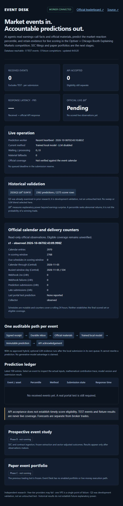
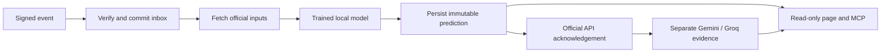

# Event Desk

**Event Desk: AI agents that read every earnings call and SEC filing as it happens,
predict how the market will react, and are scored live — in the Optiver × Chicago
Booth "Explaining Markets" competition and on our own public scoreboard.**

This is the product objective. Competition infrastructure is under construction;
SEC ingestion and live scoring are not yet operational.



## Pipeline

Signed event → durable queue → official materials → trained local prediction →
frozen prediction → competition acknowledgement.

Until a fitted hybrid is approved, optional free LLM evidence runs afterward in a
separate durable queue. Those quoted sub-scores do not change the local percentile.

The local model provides coverage when free APIs are unavailable. Structured
sub-scores make LLM outputs auditable. Evaluation is chronological, and configuration
changes are recorded before the competition begins.



The receiver acknowledges after the inbox commit. The AI evidence branch runs
after submission; the unapproved blend cannot change the current prediction.

## Status

See [verified progress](PROGRESS.md), [plan](PLAN.md), [decisions](DECISIONS.md)
and [external actions](BLOCKED.md).

[Official competition](https://explainingmarkets.ai/) ·
[Binding rules](https://explainingmarkets.ai/contest-rules) ·
[Public dashboard](https://52.17.192.36.sslip.io:80/)

[Follow an event](https://52.17.192.36.sslip.io:80/walkthrough): a separately
labelled synthetic signed request runs the actual receiver/model/worker. No
official submission or production-ledger insertion. [Engineering case study](docs/CASE-STUDY.md)
explains decisions, failed experiments, measurements and remaining limits.

### Measured engineering evidence

| Check | Actual result | Boundary |
| --- | --- | --- |
| Historical facts model | Q3 ΔR² 0.040953; 2,362 predictions | Development validation; archive unsealed |
| Dublin single-event inference | p95 2.269 ms | Archived inputs; excludes HTTP/DB/submission |
| Dublin trained-model fixture | 400 ACKs + 400 simulated results, 10.626 s | Real archived inputs; no outcomes or official POST |
| Slowest trained-model fixture ACK | 1.249 s | One measured replay, below 20 s |

Reports retain dataset, scorer and model hashes. The current live service has no
official scored observations. Public HTTPS was externally verified on October 7;
the owner still needs to save the webhook URL and send the official portal test.
The explicit port 80 carries verified TLS; standard port 443 remains unreachable.

## Run locally

```sh
docker compose up --build
```

Open `http://127.0.0.1:8000`. This uses a synthetic model, isolated PostgreSQL and
fixture credentials; no owner keys or competition submissions. The full signed
400-event replay is `docker compose exec api python fixtures/load_test.py`.

[Read-only MCP setup](docs/MCP.md): four tools over retained public records,
verified with the official SDK and an actual stdio subprocess. No trading tools.

## Stack

Python, FastAPI, PostgreSQL, Pydantic, scikit-learn, Docker and Caddy.
Gemini and Groq are optional free-tier providers. No trading credentials are required
for competition predictions.

## Limits

No verified live score, calibrated win probability or profitability is claimed.
Measured fixture/inference latency does not establish live end-to-end latency.
Competition predictions are a research task, not broker executions.
Free APIs and a single existing VPS can fail. Ten scoring days and prospective
event-study outcomes must actually occur before the full project is complete.
