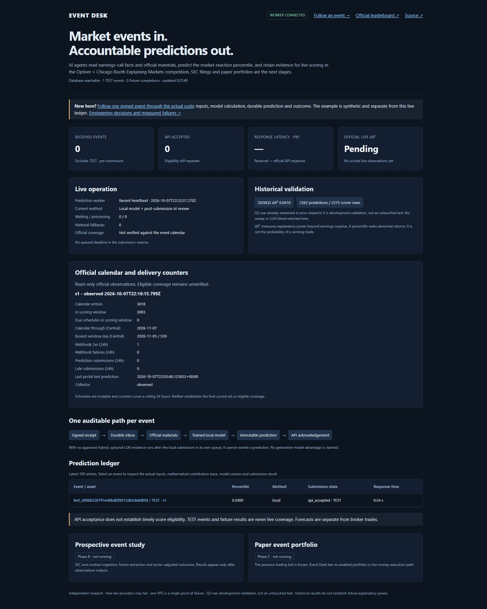
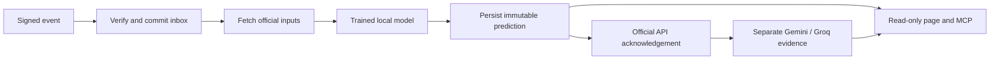

# Event Desk

A signed-webhook prediction service for the Optiver × Chicago Booth
"Explaining Markets" competition. Events are committed to PostgreSQL; the worker
persists a frozen local-model prediction before submission. Optional LLM evidence
runs separately, with quoted evidence checked against the input.

Two official portal TESTs have been accepted. The latest was received on
**8 October 2026 at 13:13:57 Madrid / 11:13:57 UTC**, with the neutral prediction
persisted and accepted by the official API. These TESTs bypass trained inference
and do not score. Accepted non-TEST events/submissions remain zero; there is no live score.
Scoring is scheduled to start on **12 October**. [Verified round trip](reports/official-test-20261008.json).

**GitHub description to copy:** Signed-webhook prediction service with PostgreSQL,
a local model and auditable LLM evidence. Official portal TESTs verified; no live score yet.

## Where this is going

The product objective is to explain market reactions to earnings calls and SEC
filings, then evaluate predictions prospectively. SEC daily ingestion and live
scoring are not yet operational.



## Pipeline

Signed event → durable queue → official materials → trained local prediction →
frozen prediction → competition acknowledgement.

Until a fitted hybrid is approved, optional free LLM evidence runs afterward in a
separate durable queue. Those quoted sub-scores do not change the local percentile.

The local model provides coverage when free APIs are unavailable. Structured
sub-scores make LLM outputs auditable. Evaluation is chronological, and configuration
changes are recorded before the competition begins.



The receiver acknowledges after the inbox commit. The AI evidence branch runs
after submission; the unapproved blend cannot change the current prediction.

## Status

See [verified progress](PROGRESS.md), [plan](PLAN.md), [decisions](DECISIONS.md)
and [external actions](BLOCKED.md).

[Official competition](https://explainingmarkets.ai/) ·
[Binding rules](https://explainingmarkets.ai/contest-rules) ·
[Public dashboard](https://52.17.192.36.sslip.io/)

[Follow an event](https://52.17.192.36.sslip.io/walkthrough): a separately
labelled synthetic signed request runs the actual receiver/model/worker. No
official submission or production-ledger insertion. [Engineering case study](docs/CASE-STUDY.md)
explains decisions, failed experiments, measurements and remaining limits.

### Measured engineering evidence

| Check | Actual result | Boundary |
| --- | --- | --- |
| Historical facts model | Q3 ΔR² 0.040953; 2,362 predictions | Development validation; archive unsealed |
| Dublin single-event inference | p95 2.269 ms | Archived inputs; excludes HTTP/DB/submission |
| Dublin trained-model fixture | 400 ACKs + 400 simulated results, 10.626 s | Real archived inputs; no outcomes or official POST |
| Slowest trained-model fixture ACK | 1.249 s | One measured replay, below 20 s |

Reports retain dataset, scorer and model hashes. Two genuine portal TESTs were
durably received and their neutral predictions accepted (201); fresh official
health confirmed them. [Latest evidence](reports/official-test-20261008.json).
Manual portal review confirmed the saved standard HTTPS URL and Live status.
Its Predictions tab lists APLD, RGP and LEVI as “Delivery refused” on October 7.
No non-TEST prediction has been accepted and there is no live score.

The review reproduced a receiver incompatibility with the official webhook
example: it rejected non-TEST payloads lacking `knowledge_cutoff`, a calendar
field absent from that example. The compatibility repair accepts that documented
shape while retaining signed-byte verification, durable deduplication and the
official-material URL boundary. The historical rejection cause remains unproven.
[Incident and regression evidence](docs/INCIDENT-2026-10-08-delivery-4xx.md).
TEST is not scored; paper portfolio and blend remain disabled.

## Run locally

Prerequisites: Git and Docker Engine/Desktop with a running daemon and Compose v2.
Run from the repository root; no owner keys are needed. See
[reproduction steps and actual checks](docs/REPRODUCE.md).

```sh
docker compose up --build
```

Open `http://127.0.0.1:8000`. This uses a synthetic model, isolated PostgreSQL and
fixture credentials; no owner keys or competition submissions. The full signed
400-event replay is `docker compose exec api python fixtures/load_test.py`.

[Read-only MCP setup](docs/MCP.md): four tools over retained public records,
verified with the official SDK and an actual stdio subprocess. No trading tools.

## Stack

Python, FastAPI, PostgreSQL, Pydantic, scikit-learn, Docker and Caddy.
Gemini and Groq are optional free-tier providers. No trading credentials are required
for competition predictions.

## Limits

No verified live score, calibrated win probability or profitability is claimed.
Measured fixture/inference latency does not establish live end-to-end latency.
Competition predictions are a research task, not broker executions.
Free APIs and a single existing VPS can fail. Ten scoring days and prospective
event-study outcomes must actually occur before the full project is complete.
