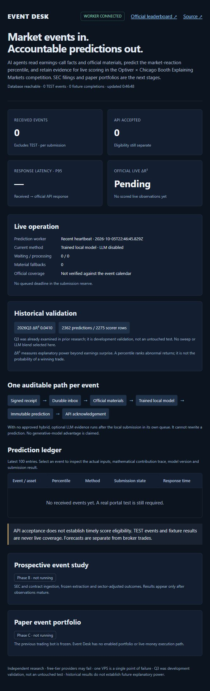

# Event Desk

**Event Desk: AI agents that read every earnings call and SEC filing as it happens,
predict how the market will react, and are scored live — in the Optiver × Chicago
Booth "Explaining Markets" competition and on our own public scoreboard.**

This is the product objective. Competition infrastructure is under construction;
SEC ingestion and live scoring are not yet operational.



## Pipeline

Signed event → durable queue → official materials → trained local prediction →
frozen prediction → competition acknowledgement.

Until a fitted hybrid is approved, optional free LLM evidence runs afterward in a
separate durable queue. Those quoted sub-scores do not change the local percentile.

The local model provides coverage when free APIs are unavailable. Structured
sub-scores make LLM outputs auditable. Evaluation is chronological, and configuration
changes are recorded before the competition begins.

## Status

See [verified progress](PROGRESS.md), [plan](PLAN.md), [decisions](DECISIONS.md)
and [external actions](BLOCKED.md).

[Official competition](https://explainingmarkets.ai/) ·
[Binding rules](https://explainingmarkets.ai/contest-rules)

### Measured engineering evidence

| Check | Actual result | Boundary |
| --- | --- | --- |
| Historical facts model | Q3 ΔR² 0.040953; 2,362 predictions | Development validation; archive unsealed |
| Dublin single-event inference | p95 2.269 ms | Archived inputs; excludes HTTP/DB/submission |
| Dublin trained-model fixture | 400 ACKs + 400 simulated results, 66.416 s | Real archived inputs; no outcomes or official POST |
| Slowest trained-model fixture ACK | 1.701 s | One measured replay, below 20 s |

Reports retain dataset, scorer and model hashes. The current live service has no
official scored observations. Public HTTPS and the portal test are still blocked;
the dashboard can be reached through the existing local SSH preview.

## Run locally

```sh
docker compose up --build
```

Open `http://127.0.0.1:8000`. This uses a synthetic model, isolated PostgreSQL and
fixture credentials; no owner keys or competition submissions. The full signed
400-event replay is `docker compose exec api python fixtures/load_test.py`.

[Read-only MCP setup](docs/MCP.md): four tools over retained public records,
verified with the official SDK and an actual stdio subprocess. No trading tools.

## Stack

Python, FastAPI, PostgreSQL, Pydantic, scikit-learn, Docker and Caddy.
Gemini and Groq are optional free-tier providers. No trading credentials are required
for competition predictions.

## Limits

No verified live score, calibrated win probability or profitability is claimed.
Measured fixture/inference latency does not establish live end-to-end latency.
Competition predictions are a research task, not broker executions.
Free APIs and a single existing VPS can fail. Ten scoring days and prospective
event-study outcomes must actually occur before the full project is complete.
